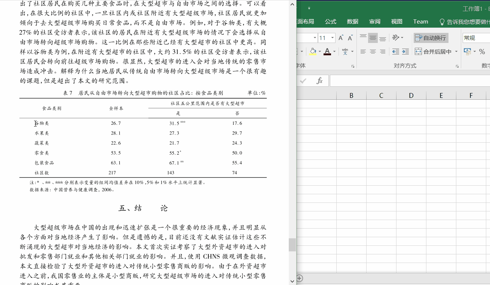

# Text Former

Current Version 0.1

This is an application for organizing text into a friendlier form.
In many situations, the text we received is illy organized. For example,
a passage copied from a PDF file is splitted by many linebreaks, which
usually need us to remove one by one. This application provide
a more elegant way to handle this kind of problems.

# Key Features: Tabularize
<!--vid here-->

Separate text into different columns so that we can copy it straight into Excel.

# Installation
This application is based on PyQt4 (python 3.4), and only tested on 
Windows 10 (64bit) platform.  This package have not been uploaded to pypi as 
well (and probably never). Therefore, to use this software you must have 
Python 3.4 and PyQt4 installed in advance. I personally recommmend Anaconda
(a python distribution with many third-party packages pre-installed and tested) 
as a convenient solution.

If Python and PyQt4 have been installed, just type the following commands in your terminal.

```{shell}
python textformer.py
```

For linux users, you can add a shebang line manually in the top of `textformer.py` file
(of course you've already known that, you are using linux).
For Windows users, you can freeze `textformer.py` into executables using 
[cx\_freeze](http://cx-freeze.sourceforge.net/).
I myself have done this successfully.

# Usage

* `Trim` -- Remove leading and trailing whitespace of a line;
* `Concatenate` -- Joining different lines of strings into one line of passage,
this feature is not supported for Chinese text at present;
* `Replace` -- Replace a character in the text. This function could be very useful
when the dots in the text is not in its standard form;
so that the `Remove Space Around Dot` function could not perform properly.
* `Remove Space Around Dot` -- Sometimes numbers in the text is splitted (by dots) 
in two parts, we could not `tabularize` it directly, otherwise each number will be divided
in two columns.
In this case, we should remove space around dots at first and then put each number together.
* `Tabularize` -- Separate text by whitespace into columns, after that you can copy text
into MS Excel as a table.

